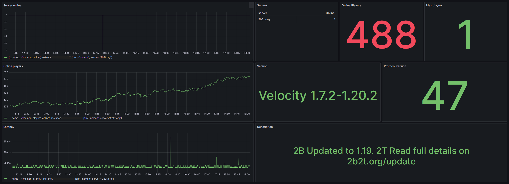

# mcmon

[](https://github.com/sch8ill/mcmon/releases)
[](https://goreportcard.com/report/github.com/sch8ill/mcmon)


---

`mcmon` is a Prometheus exporter designed to monitor Minecraft Servers using [SLP](https://wiki.vg/Server_List_Ping), providing essential metrics to track server info and player activity.

`mcmon` is built using [mclib](https://github.com/sch8ill/mclib).

---

## Installation

### Docker

```bash
docker run -p 9100:9100 sch8ill/mcmon:latest --server 2b2t.org
```

`mcmon` can monitor multiple Minecraft Servers simultaneously: `mcmon --server mc.example.com --server foo.bar.com`

### Build

Requires:

```
go >= 1.21
make
```

Build command:
```bash
make build
```

---

## Usage

### Metrics

| name                     | description                                              | labels              | type  |
|--------------------------|----------------------------------------------------------|---------------------|-------|
| `mcmon_online`           | wether the Minecraft Server is online                    | server              | gauge |
| `mcmon_players_online`   | number of current online players on the Minecraft Server | server              | gauge |
| `mcmon_players_max`      | max number of players allowed on the Minecraft Server    | server              | gauge |
| `mcmon_version`          | version name of the Minecraft Server                     | server, version     | gauge |
| `mcmon_protocol_version` | protocol version of the Minecraft Server                 | server              | gauge |
| `mcmon_description`      | description of the Minecraft Server                      | server, description | gauge |
| `mcmon_latency`          | latency of the Minecraft Server in ms                    | server              | gauge |

### Prometheus config

Example `prometheus.yml` scrape config:

```yaml
scrape_configs:
  - job_name: mcmon
    scrape_interval: 30s
    static_configs:
      - targets: ["localhost:9100"]
```

### Grafana

An [example Grafana panel](https://github.com/Sch8ill/mcmon/blob/master/grafana/mcmon.json) can be found in the [grafana directory](https://github.com/Sch8ill/mcmon/blob/master/grafana).



### CLI flags

```
   --server value [ --server value ]  address of the server to be monitored (default: "localhost:25565")
   --timeout value                    max timeout for SLP requests (default: 5s)
   --interval value                   interval the servers should checked in (default: 30s)
   --metrics-address value            address the Prometheus metrics exporter listens on (default: ":9100")
   --help, -h                         show help
```

## License

This package is licensed under the [MIT License](LICENSE).

---
